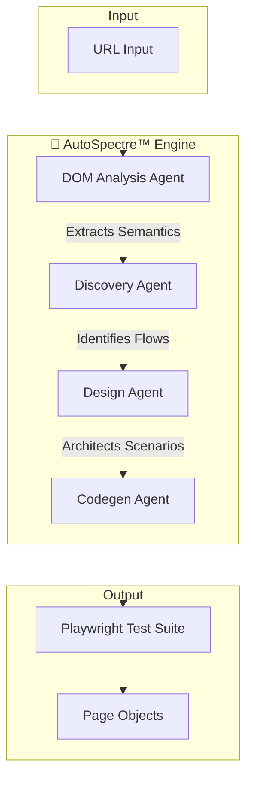

# AutoSpectre™ 🧠🧪
### AI‑Driven, Self‑Healing Playwright Test Generation Platform

[](https://opensource.org/licenses/MIT)
[](https://www.typescriptlang.org/)
[](https://playwright.dev/)
[]()

**Transform a single URL into a robust, enterprise-grade test suite in minutes.**

[Key Features](#-key-features) •
[Architecture](#-architecture) •
[Quick Start](#-quick-start) •
[Configuration](#-configuration) •
[Roadmap](#-roadmap)

---

## 📖 Introduction

**AutoSpectre™** is a next-generation QA automation platform that leverages Large Language Models (LLMs) to autonomously generate, execute, and maintain Playwright test suites. Unlike traditional record-and-playback tools, AutoSpectre™ understands the *intent* of your application, creating resilient test flows that adapt to UI changes.

> **Input**: A single URL (e.g., `https://www.saucedemo.com`)  
> **Output**: A fully functional, production-ready Playwright TypeScript test suite.

---

## ✨ Key Features

| Feature | Description |
| :--- | :--- |
| **🧠 AI-Powered Discovery** | Autonomous agents analyze the DOM to identify critical user journeys (Login, Checkout, etc.) without human intervention. |
| **⚡ Instant Codegen** | Generates clean, idiomatic [Playwright](https://playwright.dev/) TypeScript code that adheres to industry best practices. |
| **🛡️ Policy-Driven** | Enforce formatting and best practices (Page Object Model, `data-test-ids`) via simple Markdown policy files. |
| **🏗️ Agentic Architecture** | A modular pipeline where specialized agents (Discovery, Design, Codegen) collaborate to produce high-quality output. |
| **🔌 CI/CD Ready** | Zero-config integration with GitHub Actions, Jenkins, and Azure DevOps. |

---

## 🏗 Architecture

AutoSpectre™ employs a multi-stage agentic pipeline to transform raw HTML into executable code.



### Component Roles

- **DOM Analysis Agent**: Headless browser interaction to scrape and semanticize the DOM.
- **Discovery Agent**: specialized LLM that identifies potential user flows (e.g., "User executes a search").
- **Design Agent**: Structures the test steps and defining assertions based on discovered flows.
- **Codegen Agent**: Synthesizes the final TypeScript code, applying linting rules and project policies.

---

## 🚀 Quick Start

### Prerequisites

- **Node.js**: v16 or higher
- **npm**: v8 or higher

### Installation

1.  Clone the repository:
    ```bash
    git clone https://github.com/Mukuldev21/AutoSpectre.git
    cd AutoSpectre
    ```

2.  Install dependencies:
    ```bash
    npm install
    ```

### Usage

**Generate a test suite from a URL:**

```bash
npm run generate -- https://www.saucedemo.com
```

**Run the generated tests:**

```bash
npm run test
```

---

## ⚙️ Configuration

AutoSpectre™ follows the **Policy-as-Code** philosophy. You can customize the behavior of the agents by modifying the policy file at `policies/instructions.md`.

**Default Policies (`policies/instructions.md`):**

- ✅ Use **Page Object Model** (POM) structure.
- ✅ Avoid raw CSS/XPath selectors; prefer `data-test-id`.
- ✅ Group steps using `test.step()` for better reporting.
- ✅ Ensure comprehensive assertion coverage.

---

## 📝 Example Output

After running the generation command, AutoSpectre™ produces strictly typed, clean code:

```typescript
// generated/tests/Login.spec.ts
import { test, expect } from '@playwright/test';

test('[Login] Verify successful user authentication', async ({ page }) => {
  await test.step('Navigate to login page', async () => {
    await page.goto('https://www.saucedemo.com');
  });

  await test.step('Enter credentials', async () => {
    await page.fill('[data-test="username"]', 'standard_user');
    await page.fill('[data-test="password"]', 'secret_sauce');
    await page.click('[data-test="login-button"]');
  });

  await test.step('Verify redirection', async () => {
    await expect(page).toHaveURL(/.*inventory.html/);
    await expect(page.locator('.title')).toHaveText('Products');
  });
});
```

---

## 🗺️ Roadmap

- [ ] **Self-Healing Engine**: Automatically repair broken selectors during runtime.
- [ ] **Visual Regression**: Integration with Percy/Applitools.
- [ ] **Cloud Execution**: One-click run on BrowserStack/SauceLabs.
- [ ] **API Testing**: Auto-generation of API tests from Swagger/OpenAPI specs.

---

## 🤝 Contributing

Contributions are welcome! Please feel free to submit a Pull Request.

1.  Fork the Project
2.  Create your Feature Branch (`git checkout -b feature/AmazingFeature`)
3.  Commit your Changes (`git commit -m 'Add some AmazingFeature'`)
4.  Push to the Branch (`git push origin feature/AmazingFeature`)
5.  Open a Pull Request

---

## 📄 License

Distributed under the MIT License. See `LICENSE` for more information.

---

**AutoSpectre™**
> Built an AI‑driven QA platform that auto‑generates Playwright tests and self‑healing Page Objects from a single URL using agent‑based LLM orchestration.

**Created by Mukul**
