# AutoSpectre™
### AI‑Driven, Self‑Healing Playwright Test Generation Platform

[](https://opensource.org/licenses/MIT)
[](https://www.typescriptlang.org/)
[](https://playwright.dev/)
[](https://groq.com)
[]()

**Transform a single URL into a robust, enterprise-grade test suite in minutes.**

> **� Enterprise Users**: Read the comprehensive [Technical Architecture & Best Practices Guide](docs/AutoSpectre_Enterprise_Guide.md) for SOC2 compliance, scalability, and deep-dive architecture.

---

- [Introduction](#-introduction)
- [Key Features](#-key-features)
- [Enterprise Architecture](#-enterprise-architecture)
- [Quick Start](#-quick-start)
- [Configuration](#-configuration)
- [Roadmap](#-roadmap)

---

## 📖 Introduction

**AutoSpectre™** is a next-generation QA automation platform that leverages Large Language Models (LLMs) to autonomously generate, execute, and maintain Playwright test suites. Unlike traditional record-and-playback tools, AutoSpectre™ understands the *intent* of your application, creating resilient test flows that adapt to UI changes.

> **Input**: A single URL (e.g., `https://www.saucedemo.com` or your own application)  
> **Output**: A fully functional, production-ready Playwright TypeScript test suite.
> *Note: While documentation uses `saucedemo.com` for demonstration, AutoSpectre™ is designed to work with ANY web application.*

---

## ✨ Key Features

| Feature | Description |
| :--- | :--- |
| **🧠 AI-Powered Discovery** | Autonomous agents analyze the DOM to identify critical user journeys (Login, Checkout, etc.) without human intervention. |
| **⚡ Instant Codegen** | Generates clean, idiomatic [Playwright](https://playwright.dev/) TypeScript code that adheres to industry best practices. |
| **🛡️ Policy-Driven** | Enforce formatting and best practices (Page Object Model, `data-test-ids`) via simple Markdown policy files. |
| **🏗️ Agentic Architecture** | A modular pipeline where specialized agents (Discovery, Design, Codegen) collaborate to produce high-quality output. |
| **🔌 CI/CD Ready** | Zero-config integration with GitHub Actions, Jenkins, and Azure DevOps. |

---

## 🏗 Enterprise Architecture

AutoSpectre™ employs a multi-stage agentic pipeline to transform raw HTML into executable code.

```mermaid
flowchart TD
    subgraph Input
        A[URL Input]
    end

    subgraph Core_Engine ["🧠 AutoSpectre™ Engine"]
        B[DOM Analysis Agent] -- Extracts Semantics --> C[Discovery Agent]
        C -- Identifies Flows --> D[Design Agent]
        D -- Architects Scenarios --> E[Codegen Agent]
    end

    subgraph Output
        E --> F[Playwright Test Suite]
        F --> G[Page Objects]
    end

    A --> B
```



**Component Roles:**
- **DOM Analysis Agent**: Headless browser interaction to scrape and semanticize the DOM.
- **Discovery Agent**: specialized LLM that identifies potential user flows (e.g., "User executes a search").
- **Design Agent**: Structures the test steps and defining assertions based on discovered flows.
- **Codegen Agent**: Synthesizes the final TypeScript code, applying linting rules and project policies.

---

## 🚀 Quick Start

### Prerequisites
- **Node.js**: v16+
- **npm**: v8+

### Installation

1.  **Clone the repository**
    ```bash
    git clone https://github.com/Mukuldev21/AutoSpectre.git
    cd AutoSpectre
    ```

2.  **Install dependencies**
    ```bash
    npm install
    ```

### Usage

**Generate a test suite from a URL**
*(Example using saucedemo, but works with any URL)*
```bash
npm run generate -- https://www.saucedemo.com
# OR
npm run generate -- <your-target-url>
```

**Set up CI/CD Pipeline**
```bash
npm run setup:ci
```

**Run the generated tests**
```bash
npm run test
```

---

## ⚙️ Configuration

AutoSpectre™ follows the **Policy-as-Code** philosophy. User behaviors are customizable via `policies/instructions.md`.

**Default Policies:**
- ✅ Use **Page Object Model** (POM) structure
- ✅ Avoid raw CSS/XPath selectors (prefer `data-test-id`)
- ✅ Group steps using `test.step()` for detailed reporting
- ✅ Comprehensive assertion coverage

---

## 📝 Example Output

```typescript
// generated/tests/Login.spec.ts
import { test, expect } from '@playwright/test';

test('[Login] Verify successful user authentication', async ({ page }) => {
  await test.step('Navigate to login page', async () => {
    await page.goto('https://www.saucedemo.com');
  });

  await test.step('Enter credentials', async () => {
    await page.fill('[data-test="username"]', 'standard_user');
    await page.fill('[data-test="password"]', 'secret_sauce');
    await page.click('[data-test="login-button"]');
  });

  await test.step('Verify redirection', async () => {
    await expect(page).toHaveURL(/.*inventory.html/);
    await expect(page.locator('.title')).toHaveText('Products');
  });
});
```

---

## 🗺️ Roadmap

- [x] **Self-Healing Engine**: Automatically repairs broken selectors during runtime using a learned memory system.
- [x] **Groq Integration**: High-speed test generation using `llama-3.3-70b-versatile`.
- [x] **Visual Regression**: Integrated with Playwright Snapshots.
- [ ] **Cloud Execution**: One-click run on BrowserStack/SauceLabs (Coming Q2).
- [ ] **API Testing**: Auto-generation of API tests from Swagger/OpenAPI specs.

---

## 🤝 Contributing

We welcome contributions!
1.  Fork the Project
2.  Create your Feature Branch
3.  Commit your Changes
4.  Push to the Branch
5.  Open a Pull Request

---

## 📄 License

Distributed under the MIT License. See `LICENSE` for more information.

---

**AutoSpectre™**
> Built an AI‑driven QA platform that auto‑generates Playwright tests and self‑healing Page Objects from a single URL using agent‑based LLM orchestration.

**Created by Mukul**
