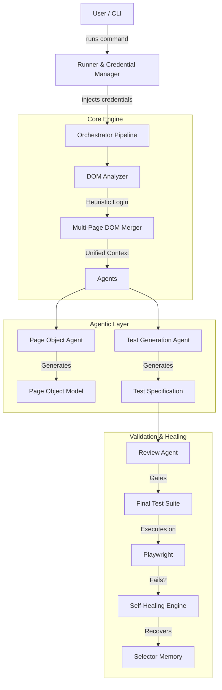

# AutoSpectre™:
## Technical Architecture & Best Practices Guide

**Version:** 1.0.0
**Date:** December 18, 2025
**Author:** AutoSpectre™ Team

---

## 1. Executive Summary

AutoSpectre™ is a next-generation **AI-Powered Quality Assurance Platform** designed to automate the end-to-end testing lifecycle. Unlike traditional frameworks that require manual scripting, AutoSpectre™ leverages Generative AI (LLMs) and intelligent DOM analysis to:

1.  **Discover** application flows automatically.
2.  **Generate** robust, self-healing Playwright tests for **any web application**.
3.  **Validate** code against strict enterprise standards (Page Object Model).
4.  **Heal** broken selectors during execution without human intervention.
5.  ** Universal Compatibility**: While `saucedemo.com` is used for demonstration, the platform fully supports custom enterprise applications, SaaS platforms, and internal tools.

This document serves as the comprehensive guide to AutoSpectre™'s architecture, capabilities, and operational best practices.

---

## 2. System Architecture

AutoSpectre™ operates as a sophisticated pipeline of specialized agents and engines.



---

## 3. Core Capabilities

### 3.1. Intelligent DOM Analysis & Heuristic Login
The **DOM Analyzer** is the eyes of the system. It goes beyond simple HTML parsing:
-   **Deep Scanning**: Extracts semantic inputs, buttons, headers (`h1-h3`), and logical containers.
-   **Heuristic Login**: If a login page is detected (and credentials are available), the analyzer *automatically* logs in using a demonstration account (`standard_user`).
-   **Multi-Page Stitching**: It captures the DOM state *before* and *after* login, deduplicates the elements, and merges them. This allows the AI to write tests that span across authentication boundaries (e.g., "Login -> Verify Dashboard").

### 3.2. Context-Aware Test Generation
The **Test Agent** is driven by a sophisticated prompt (`test-agent.prompt.md`) that enforces a **3-Flow Strategy** for every page:
1.  **Happy Path**: The critical user journey (e.g., Successful Purchase).
2.  **Data Validation**: Checking for required fields or invalid formats.
3.  **Edge Cases**: Boundary testing (e.g., Empty Cart, Special Characters).

### 3.3. Self-Healing Engine
Tests are brittle by nature. AutoSpectre™ mitigates this with a run-time healing mechanism:
-   **Selector Resolution**: If the primary selector fails (e.g., `#login_button`), the engine iterates through a list of fallback selectors (Text, CSS, XPath).
-   **Memory Persistence**: Successful fallbacks are saved to `selector-memory.json`, making subsequent runs faster.

### 3.4. Intelligent Credential Management
Security and ease-of-use are balanced via the **Credential Manager**:
-   **Environment Variables**: First priority is `.env` for CI/CD pipelines.
-   **Intelligent Auto-Save**: When you run `npm run generate <url> --user=<val> --pass=<val>`, credentials are encrypted/saved locally to `credentials.json` (git-ignored).
-   **Auto-Load**: Subsequent runs automatically recall these credentials, enabling "Zero-Touch" analysis.

---

## 4. Best Practices

To maintain "Enterprise Level" reliability, adhere to these guidelines:

### 4.1. Code Generation Standards
*   **Strict Page Object Model (POM)**: NEVER write raw Playwright selectors (e.g., `page.click('.btn')`) in test files. Always delegate to the `AppPage` class.
*   **Encapsulation**: Tests should read like English sentences (e.g., `await appPage.loginButton().click()`).
*   **Review Gates**: The **Review Agent** automatically rejects generated code that violates these rules. Do not bypass it.

### 4.2. Operational Workflow
1.  **Demonstrate First**: For new applications, run the generation with credentials once to prime the memory.
    `npm run generate https://example.com --user=admin --pass=secret`
2.  **Review Artifacts**: Always inspect `generated/tests/` before committing. The AI is powerful but human review ensures business logic alignment.
3.  **Commit Policy**: 
    -   ✅ Commit `generated/tests/`
    -   ✅ Commit `src/pages/`
    -   ❌ NEVER Commit `credentials.json` or `.env`

### 4.3. Extension & maintenance
*   **New Heuristics**: Update `domAnalyzer.ts` if you encounter a new navigation pattern (e.g., 2FA).
*   **Prompt Engineering**: Modify `prompts/test-agent.prompt.md` to change the "personality" or strictness of the generated tests.

---

## 5. Usage Guide

### Installation
```bash
npm install
cp .env.example .env  # Configure your LLM API Key
```

### Generating Tests
**Basic Usage:**
*Note: `www.saucedemo.com` is used here as an example. AutoSpectre™ works with any accessible URL.*
```bash
npm run generate https://www.saucedemo.com
# OR for your own application:
npm run generate <your-application-url>
```

**With Credentials (Auto-Save):**
```bash
npm run generate https://www.saucedemo.com --user=standard_user --pass=secret_sauce
# OR for your own application:
npm run generate <your-application-url> --user=<username> --pass=<password>
```

### Setting up CI/CD
**Generate GitHub Actions Workflow:**
```bash
npm run setup:ci
```
*This command automatically creates `.github/workflows/autospectre-ci.yml` for instant Continuous Integration.*

### Running Tests
```bash
npm run test
```

### Visual Testing
The generated "Happy Path" tests include an automatic visual check.
- **First Run**: Will likely fail with "Snapshot missing".
- **Baseline**: Run the following to create the initial snapshot:
  ```bash
  npx playwright test --update-snapshots
  ```

### Viewing Traces
```bash
npx playwright show-report
```

---

*Generated by AutoSpectre™ - 2025*
